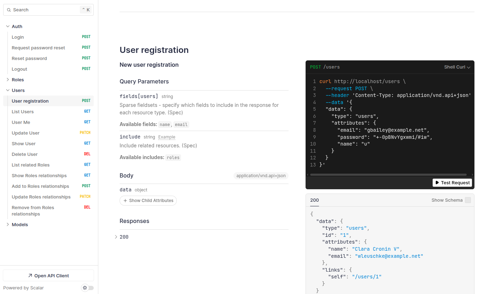

# Quickstart

To get started with a new Laravel Doctrine JSON:API project, run the following commands in your terminal:

```bash
composer create-project sowl/laravel-doctrine-jsonapi-skeleton jsonapi
cd jsonapi
```

Next, launch the development server:

```bash
composer run dev
```

The API will be available at [http://localhost:8000](http://localhost:8000).

### Features Included

- **Full Laravel Doctrine JSON:API functionality:** All features provided are available out of the box.
- **Authentication:** The project comes with a simple authentication system and a pre-configured `User` entity.
- **RBAC Authorization:** Role-Based Access Control is included, with predefined roles to help you manage permissions from the start.
- **Laravel Sanctum integration:** Secure API authentication using [Laravel Sanctum](https://laravel.com/docs/10.x/sanctum).
- **Doctrine migrations:** Database migrations are managed using [Laravel Doctrine ORM Migrations](https://www.laraveldoctrine.org/docs/current/migrations/).
- **Automatic OpenAPI documentation generation:** Instantly up-to-date API docs are generated for your endpoints.

## Laravel Sail

You can run the project using [Laravel Sail](https://laravel.com/docs/12.x/sail), a Docker-based local development environment for Laravel.

**Prerequisites:**
- [Docker](https://www.docker.com/get-started) must be installed on your machine.

**To start the development environment with Sail:**

```bash
./vendor/bin/sail up -d
```

This will start all required containers in the background. The API will be available at [http://localhost](http://localhost).

**Running commands with Sail:**

You can prefix any Artisan, Composer, or PHPUnit command with `./vendor/bin/sail`:

```bash
./vendor/bin/sail artisan doctrine:migrations:migrate
./vendor/bin/sail test
```

For more details, see the [Laravel Sail documentation](https://laravel.com/docs/12.x/sail).


## OpenAPI

API documentation is available at [http://localhost/docs](http://localhost/docs) it's served with [Scalar.](https://scalar.com/).



You can start interacting with the API using the Test Request functionality.

  * [Register](http://localhost/docs#tag/auth/POST/auth/register)
  * [Login](http://localhost/docs#tag/auth/POST/auth/login)
  * [Fetch Me](http://localhost/docs#tag/users/GET/api/users/me)

## Continue

Now that your environment is running, you can start building your API by creating entities, running migrations, and defining controllers and routes.

Explore the rest of the documentation to learn more about advanced features, customization, and best practices.
